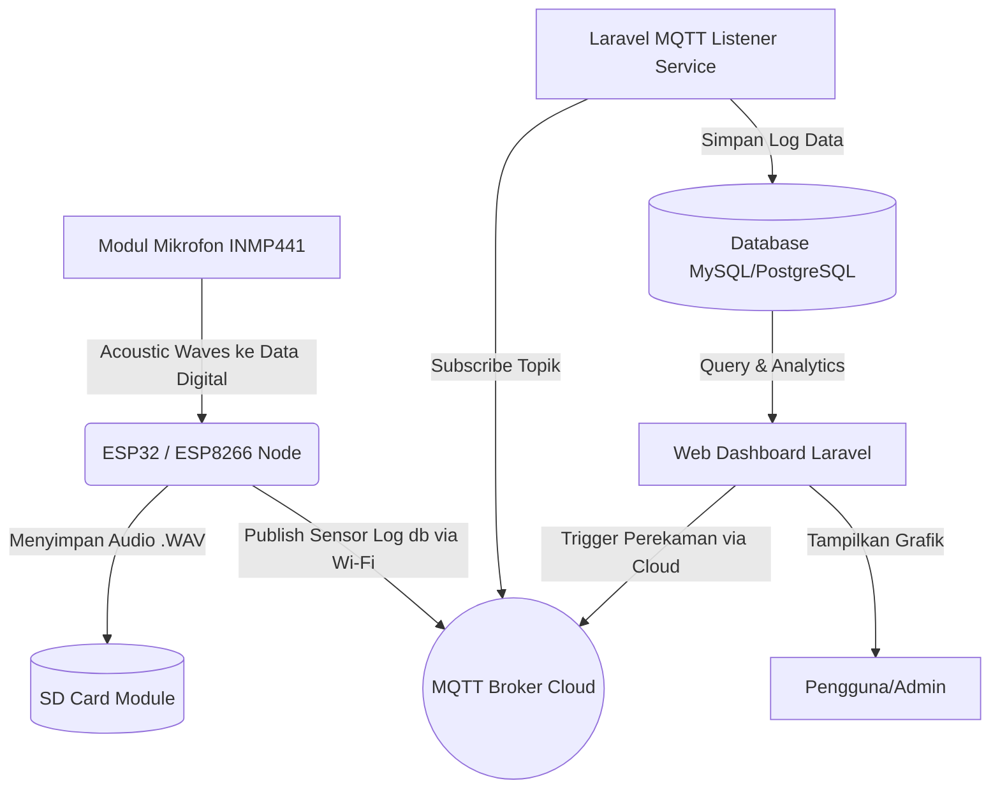

# BUKU PANDUAN PENGGUNAAN (USER MANUAL) KOMPREHENSIF
## SISTEM MONITORING KEBISINGAN IOT (NOISEMONIOT)

---
> **Catatan Pengeditan HKI:** Silakan ganti teks `[Masukkan Screenshot ...]` dengan gambar tangkapan layar (screenshot) asli dari aplikasi Anda menggunakan kombinasi tombol `Windows + Shift + S` lalu tempel (Paste) pada dokumen ini, sebelum menyimpannya ke format PDF.

### DAFTAR ISI
1. [Pendahuluan](#1-pendahuluan)
2. [Glosarium (Daftar Istilah)](#2-glosarium-daftar-istilah)
3. [Spesifikasi Sistem dan Persyaratan Minimum](#3-spesifikasi-sistem-dan-persyaratan-minimum)
4. [Topologi dan Arsitektur Sistem](#4-topologi-dan-arsitektur-sistem)
5. [Panduan Langkah Demi Langkah Modul Web Dashboard](#5-panduan-langkah-demi-langkah-modul-web-dashboard)
6. [Panduan Konfigurasi Standalone Local Node](#6-panduan-konfigurasi-standalone-local-node)
7. [Panduan Instalasi Server dan Deployment](#7-panduan-instalasi-server-dan-deployment)
8. [Pemecahan Masalah (Troubleshooting)](#8-pemecahan-masalah-troubleshooting)

---

### 1. Pendahuluan
**NoiseMoniot (Noise Monitor IoT)** adalah sebuah sistem aplikasi berbasis _Internet of Things_ (IoT) dan platform Web yang dikembangkan untuk memonitor, merekam, dan menganalisis tingkat kebisingan (Sound Pressure Level / SPL) di suatu lingkungan industri atau publik secara presisi dan waktu nyata (real-time). 

Aplikasi ini menyajikan solusi ujung-ke-ujung (end-to-end), dimulai dari pembacaan data desibel oleh sensor mikrokontroler di lapangan, hingga penyajian grafik analitik dan fasilitas penugasan perekam suara mandiri pada pusat kontrol berbasis web yang dapat diakses dari mana saja.

---

### 2. Glosarium (Daftar Istilah)
*   **IoT (Internet of Things):** Konsep komputasi untuk mendeskripsikan perangkat fisik (sensor) yang terhubung ke internet untuk bertukar data.
*   **SPL (Sound Pressure Level):** Ukuran logaritmik dari tekanan suara efektif dari suatu bunyi terhadap nilai referensi. Dinyatakan dalam satuan **Decibel (dB)**.
*   **MQTT (Message Queuing Telemetry Transport):** Protokol pesan ringan yang dirancang untuk sensor IoT guna pengiriman pertukaran data secara _Publish_ dan _Subscribe_.
*   **MicroSD:** Media penyimpanan data secara lokal di perangkat keras untuk menampung ukuran besar rekaman audio berekstensi `.wav`.
*   **Standalone Auth / Local Node UI:** Portal antarmuka web statis bawaan milik mikrokontroler (ESP32) yang dapat diakses luring untuk keperluan modifikasi koneksi jaringan (tanpa harus memodifikasi penulisan kode sumber).

---

### 3. Spesifikasi Sistem dan Persyaratan Minimum

| Kategori | Spesifikasi Komponen | Fungsi Utama |
| :--- | :--- | :--- |
| **Piranti Keras (Hardware)** | Mikrokontroler **ESP32** atau ESP8266 | Otak pemrosesan lokal logika node alat |
| | Sensor Mikrofon I2S (**INMP441** / MSM261S4030H0) | Perekam gelombang dan frekuensi audio presisi tinggi |
| | Modul MicroSD Card Reader | Media penyimpanan fisik (Offline / Internal Storage) file suara tipe WAV |
| **Piranti Lunak Frontend** | Node.js (Vite), TailwindCSS, Blade Components | Mengelola tata letak dan interaksi (_User Interface_) di browser |
| **Piranti Lunak Backend** | PHP 8.1+, Framework **Laravel 10/11** | Mengelola autentikasi, API, dan logika penyimpanan ke pangkalan data |
| **Pangkalan Data (Database)**| **MySQL** 8.0 / PostgreSQL 14+ | Relasi penyimpan seluruh _history_ log SPL Sensor dan akun |
| **Komunikasi (Middleware)** | MQTT Broker (misal: HiveMQ/Mosquitto) | Menjadi jembatan pesan antara ESP32 dan Backend Laravel |
| **Service Background** | Supervisor (Linux daemon) | Mengelola agar Laravel Scheduler (Cron) & Listener terus hidup |

---

### 4. Topologi dan Arsitektur Sistem

Aliran data pada sistem NoiseMoniot bekerja melalui skema **_Three-Tier Architecture_** sebagai berikut:

1.  **Level Node:** Suara ditangkap mikrofon I2S -> Diproses dengan Fast Fourier Transform (FFT) oleh ESP32 menjadi nilai dB (SPL) -> Dikalkulasikan dengan nilai koefisien/offset -> Dikirim via Wi-Fi ke MQTT.
2.  **Level Transport:** Ekosistem _Message Broker_ (MQTT) menerima data log di topik spesifik untuk kemudian didengarkan (Subscribe) oleh Server Backend secara terus menerus (Listener Service).
3.  **Level Server:** Log disimpan di Database. Platform Laravel lalu menyajikan rekam jejak tersebut melalui halaman interaktif. Pengguna di Web juga dapat mereverse-instruksi (mengatur instruksi Start Recording) dari Dashboard, dimana _Listener_ di aplikasi kembali mem-publis pesan MQTT yang akan membangkitkan rutinitas rekam audio fisik di ESP32.

---

### 5. Panduan Langkah Demi Langkah Modul Web Dashboard

#### A. Otentikasi dan Login
Sistem web portal dilindungi dengan mekanisme kredensial berbasis sesi berganda.
1.  Buka *Web Browser* modern (Chrome/Edge/Firefox). Ketikkan IP Lokal server bawaan (`http://127.0.0.1:8000`) atau domain produksi yang ditentukan.
2.  Sistem segera menolak akses anonim dan akan meredirect layar ke **Formulir Otentikasi Otomatis (Login)**.
    > 

3.  Isikan alamat pos-el (e-mail) dan kata sandi otoritatif. Tekan tuas **Sign in / Login**.

#### B. Observasi Dashboard Utama (Ikhtisar)
Panel Beranda adalah kompendium eksekutif sistem yang memberi kesan pemantauan seketika atas seluruh titik mesin yang disebar.
1.  Setelah validasi berhasil, Anda akan disambut oleh deretan **Widget Informasi**. Kolom hijau/merah menandakan mana alat-alat _(nodes)_ yang sinkron (*Online*) dan mana yang terputus koneksi.
    > 
    >

2.  Perhatikan **Tabel Status Terkini** di bagian tengan beranda; ini memperlihatkan nilai angka tegangan *Noise/Sound Pressure Level* di waktu ter-mutakhir dari masing-masing alat.

#### C. Penugasan & Manajemen Konfigurasi Alat (Devices)
Administrator memiliki kontrol total menambah dan memperbaiki kalkulasi alat secara per-unit agar tetap selaras.
1.  Klik menu samping kiri (*Sidebar Menu*) berlabel **"Devices"** (Perangkat).
2.  Klik opsi **"Tambah Device Baru"**. Layar pop-up (Modal Form) terbuka.
    > 
    >

3.  Ketikkan **Device ID** (Kode MAC Address spesifik mikrokontroler yang telah didaftarkan dalam koding). Jangan sampai salah huruf.
4.  Ketikkan Label Nama Ruangan (misalnya: "Genset Timur"), lalu Anda dipersilakan menyesuaikan kurva kepekaan dengan **Memasukkan _SPL Offset_**. (Contoh isi: 2.0 atau -1.5). Ini krusial sebagai nilai penambah baku kalibrasi *hysteresis*.
5.  Tekan **Simpan**.

#### D. Monitoring Time-Series dan Grafik Kebisingan Berjalan
1.  Masuk ke halaman Profil suatu alat yang spesifik. Di panel ini terdapat bagan **Line Chart (Grafik Garis)** fluktuasi level tekanan bunyi (dB).
    > 

2.  Indikator vertikal merepresentasikan skala amplitudo *Decibel*, sedangkan jalur horisontal menggambarkan waktu. Titik-titik ekstrem yang memuncak memberi tahu admin kapan suara keras yang ganjil (berbahaya) terjadi pada area tersebut.

#### E. Fitur Komando Rekam Audio Interaktif (Audio Recorder Control)
Ini merupakan jantung dari fungsi sistem di mana intervensi manusia atau *server* bisa mengambil sampel faktual audio ruangan yang dituju secara manual.
1.  Buka panel navigasi menuju tab khusus **Audio Recording** dari suatu alat. 
    > 
    
2.  Tekan tombol berlabel **"Start Recording"** (Mulai Rekam). Server mengeksekusi paket MQTT. Alat fisik di lokasi (ESP32) yang menerima instruksi tersebut akan mengawali rutinitas membakar suara masuk ke SD-Card (Menulis WAV Header).
3.  Tekan tombol berlabel **"Stop Recording"**. Rekaman terhenti dan ditutup secara sempurna.
    > 

4.  Beralih ke tab tabel rekaman bawaan. Di sini akan muncul *file* baru. Anda diizinkan memutar, mendengarkan kembali secara *streaming* hasil rekamannya, atau mengunduhnya secara permanen.

#### F. Fitur Penjadwalan Otomatis (Cron Scheduled Record)
1.  Pilih menu navigasi sisi berlabel **"Schedules (Jadwal)"**.
    > 

2.  Modul ini membedakan alat ini di pasaran. Anda tak perlu memencet tombol rekam tiap pukul empat sore. 
3.  Klik "Buat Jadwal Baru". Pilih alat *target*, lalu atur penanda waktu pada parameter **Waktu Jam Mulai** serta isikan berapa menit takar jeda durasi (Disediakan menu *dropdown*).
4.  Background task di sistem Linux/Windows peladen akan selalu bersiaga memeriksa jadwal dan otomatis men-trigger langkah poin "E(2)".

#### G. Pusat Pelaporan dan Ekstraksi Spreadsheet (Excel)
1.  Masuk pada segmen navigasi **"Reports/Logs"**.
    > 
    > 

2.  Tentukan parameter kurun waktu dengan menekan kalender pop-up kustom (Misal: Tanggal 1 - 5 Juni). Pilih target ID Perangkat jika hanya menginginkan data singularitas alat tertentu.
3.  Tekan **Eksport Ke Excel / Unduh**.
4.  Himpunan puluhan ribu _log database MySQL_ akan dipadatkan dan diunduh ke bentuk kolom _Microsoft Excel_ (`.xlsx`) siap olah untuk keperluan pemeliharaan prediktif (Predictive Maintenance).

---

### 6. Panduan Konfigurasi Standalone Local Node
Fasilitas istimewa pada mikrokontroler **ESP32/ESP8266** dari NoiseMoniot yang bisa beroperasi ganda. Bila alat baru saja dibawa ke lokasi ber-WiFi baru, Anda tidak perlu mengubah kode program (_compile_ ulang _firmware_). Cukup manfaatkan server kecil buatan internal _chip_ tersebut.

**Langkah Penyelarasan Standalone:**
1.  Nyalakan Modul Komponen ESP32 dengan sumber listrik (5V Adaptor/USB). Saat tidak mendapat sinyal, ia akan memancarkan spektrum nirkabelnya sendiri yang bertindak sebagai _Access Point (Router)_.
2.  Ambil laptop/ponsel dari sakunya, cari dan *hubungkan sinyal Wi-Fi bernama "NoiseMoniot-AP"*.
3.  Jalankan browser lokal dan perintahkan _url_ gateway bawaan: **`http://192.168.4.1`**.
    > `[Masukkan Screenshot 9: Portal Otentikasi Login Perangkat Lokal (Standalone Auth)]`
4.  Ketik masuk kredensial _Username_ rahasia teknisi (_default hardcode_ pabrik alat) guna membuka gembok pelindung antarmuka. 
5.  Setelah Anda diizinkan lewat, Portal Konfigurator WiFi dan MQTT terbuka seketika.
    > `[Masukkan Screenshot 10: Tampilan Form Isian SSID, Password Wi-Fi dan Informasi Server Broker]`
6.  Salin dan isikan informasi Wi-Fi ruang target lengkap dengan sandinya, serta Hostname beserta sandi protokol layanan langganan _MQTT Cloud_.
7.  Tekan tombol **"Save Configuration"**. ESP32 alat akan _reboot_ sendiri dan meresap secara permanen ke router utama lokasi layaknya piranti lokal sah. _Access Point darurat terhapus secara sendirinya dengan apik_.

---

### 7. Panduan Instalasi Server dan Deployment
*(Informasi Teknis Untuk System Administrator)*

Bagi Administrator guna melakukan pemeliharaan pada PC Induk atau OS Produksi (Misal: Ubuntu Cloud VM).
1. Tarik modul integrasi terkini
   `git pull origin main`
2. Pasang prasyarat PHP dan *library frontend*
   `composer install --no-dev --optimize-autoloader`
   `npm install && npm run build`
3. Ratakan tabel pangkalan data di repositori kosong
   `php artisan migrate --force`
   `php artisan optimize:clear`
4. Normalisasi kebijakan otorisasi hak baca/tulis bundel program untuk izin _www-data_
   `chmod -R 775 storage bootstrap/cache`
   `chown -R www-data:www-data storage bootstrap/cache`
5. Eksekutor _listener_: Pasang berkas `setup-supervisor.sh` lalu restart layanan guna menjaga kestabilan MQTT Daemon Listener di pinggir sistem:
   `sudo bash setup-supervisor.sh`
   `supervisorctl restart all`

---

### 8. Pemecahan Masalah (Troubleshooting)

**Indikasi 1: Alat Tampak _Offline_ Namun Lampu Hidup.**
*   Penyebab: Kredensial Wi-Fi berubah di lokasi, atau Broker MQTT server Cloud mati._
*   Solusi: Lakukan prosedur "Panduan Konfigurasi Standalone Local Node" di atas untuk memperbarui nama SSID dan Password _Router Wi-Fi_. Alternatif, restart *Supervisor* MQTT Listener di Server Pusat.

**Indikasi 2: Audio Terekam di SD Card Berukuran Nol (*0 Bytes*).**
*   Penyebab: Rangkaian pin kelistrikan protokol I2S antara mikrofon INMP441 dengan ESP32 tidak tersambung sempurna / ada soket lepas (Hardware error), ATAU Modul MicroSD _corrupt_ dan _WAV Header_ tidak sukses diposisikan pada alamat 0 saat penutupan File_.
*   Solusi: Ganti fisik MicroSD, pastikan format dasarnya adalah _FAT32_. Kencangkan solder soket male-to-female pin I2S antara alat baca bunyi dan _board_ utama.

**Indikasi 3: Fitur Export ke Excel Selalu Gagal/Blank.**
*   Penyebab: Ukuran *records database* terlalu besar melebihi alokasi memori PHP (Limit Exceeded) dalam kurun waktu ekspor rentang *query*.
*   Solusi: Perkecil saringan batas hari melalui _Filter Bar_. Sebaiknya Unduh eksportasi Excel tersebut per-2 atau 4 hari kalender kerja, ketimbang merentang 1 bulan penuh yang mengakibatkan _Timeout_. Bagi teknisi *IT backend*, silakan perbesar batasan _Memory Limit_ (cth: `memory_limit = 512M`) dalam setelan `/etc/php/8.x/fpm/php.ini`.
